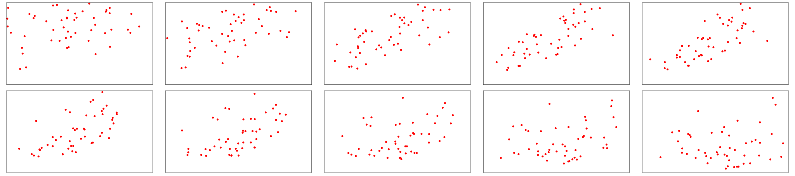
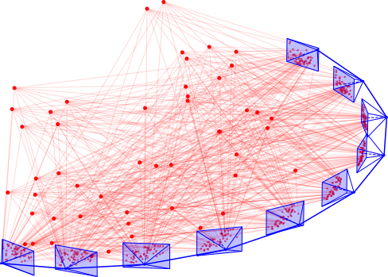
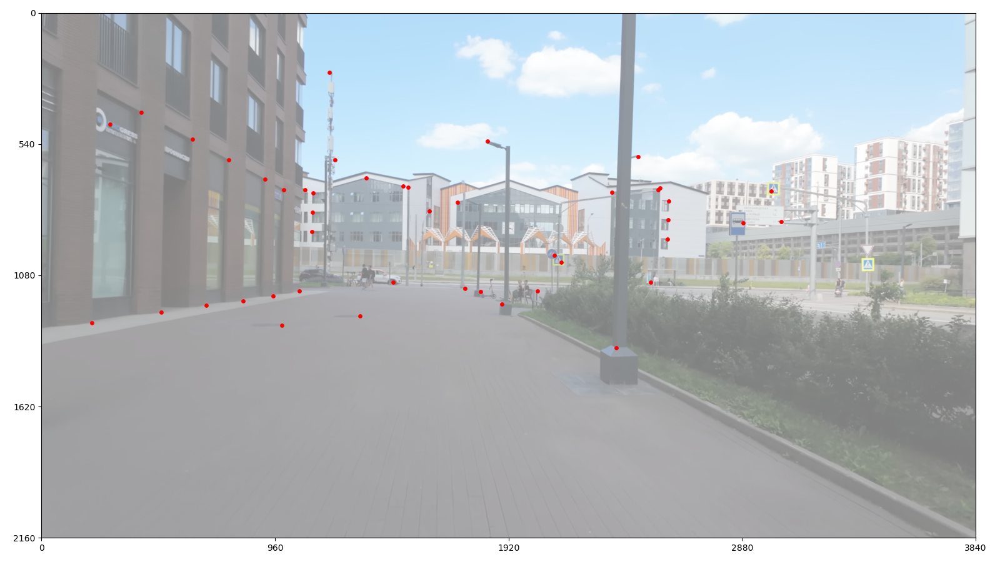
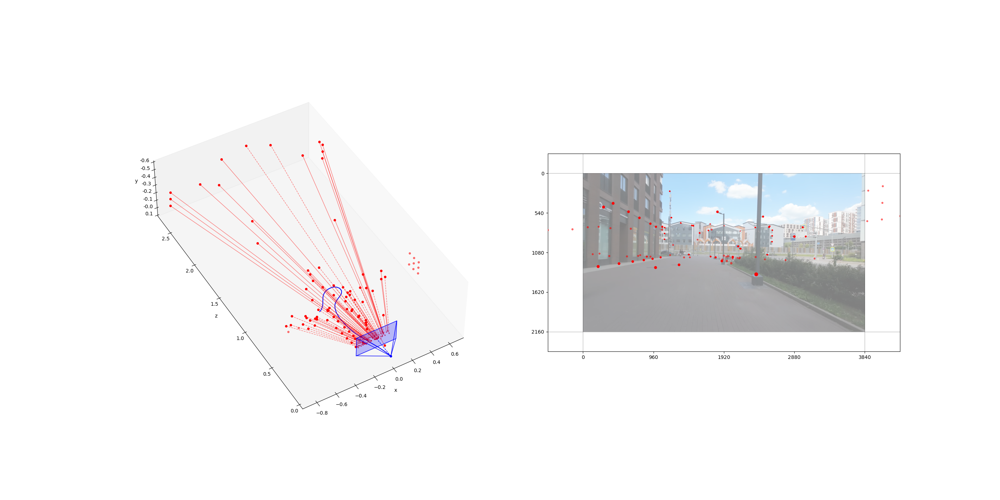

# Восстановление пространственных расположений ключевых точек и камер по последовательности изображений

## Краткая постановка задачи

* **Входы** — последовательность кадров с изображениями ключевых точек:

    

* **Выход** — трехмерная реконструкция сцены:

    

---

**Используемые обозначения:**

* Искомые параметры сцены:
    * Ключевые точки:

      <!-- $\displaystyle \boldsymbol{x}^i = [\kern1pt x^i, y^i, z^i]^T$ — пространственные координаты $i$-й ключевой точки. -->
       — пространственные координаты $i$-й ключевой точки

      <!-- $i = 1, \dots, N$. -->
      

    * Камеры:

      <!-- $\displaystyle \boldsymbol{c}^{(j)} = [\kern1pt c_x^{(j)}, c_y^{(j)}, c_z^{(j)}]^T$ — пространственные координаты $j$-й камеры. -->
      %7D=%5B%5Ckern1pt%20c_x%5E%7B(j)%7D,c_y%5E%7B(j)%7D,c_z%5E%7B(j)%7D%5D%5ET%7D) — пространственные координаты $j$-й камеры

      <!-- $\displaystyle \boldsymbol{\theta}^{(j)} = [\kern1pt \theta_x^{(j)}, \theta_y^{(j)}, \theta_z^{(j)}]^T$ — пространственные углы поворотов $j$-й камеры. -->
      %7D=%5B%5Ckern1pt%5Ctheta_x%5E%7B(j)%7D,%5Ctheta_y%5E%7B(j)%7D,%5Ctheta_z%5E%7B(j)%7D%5D%5ET%7D) — пространственные углы поворотов $j$-й камеры

      <!-- $\displaystyle \varphi_\mathrm{x}$ — горизонтальный угол обзора всех камер. -->
       — горизонтальный угол обзора всех камер.

      <!-- $j = 1, \dots, K$. -->
      

    <!-- $\boldsymbol{X} = \{\boldsymbol{x}^i\}_{i=1}^N$, $\ \boldsymbol{C} = \{\boldsymbol{c}^{(j)}\}_{j=1}^K$, $\ \boldsymbol{\varTheta} = \{\boldsymbol{\theta}^{(j)}\}_{j=1}^K$. -->
    %7D%5C%7D_%7Bj=1%7D%5EK,%5C;%5Cboldsymbol%7B%5CvarTheta%7D=%5C%7B%5Cboldsymbol%7B%5Ctheta%7D%5E%7B(j)%7D%5C%7D_%7Bj=1%7D%5EK%7D)

* Изображения ключевых точек, полученные с камер:

    <!-- $\displaystyle \overset{\text{pc}}{\textbf{x}} \kern0pt ^{i,(j)} = [\kern1pt \overset{\text{pc}}{\text{x}} \kern0pt ^{i,(j)}, \overset{\text{pc}}{\text{y}} \kern0pt ^{i,(j)}]^T$ — координаты центра входного пикселя изображения $i$-й ключевой точки с $j$-й камеры. -->
    %7D=%5B%5Ckern1pt%5Coverset%7B%5Ctext%7Bpc%7D%7D%7B%5Ctext%7Bx%7D%7D%5Ckern0pt%5E%7Bi,(j)%7D,%5Coverset%7B%5Ctext%7Bpc%7D%7D%7B%5Ctext%7By%7D%7D%5Ckern0pt%5E%7Bi,(j)%7D%5D%5ET%7D) — координаты центра входного пикселя изображения $i$-й ключевой точки с $j$-й камеры

    <!-- $\displaystyle \textbf{x}^{i,(j)} = \mathbf{x} (\boldsymbol{x}^i, \boldsymbol{c}^{(j)}, \boldsymbol{\theta}^{(j)}, \varphi_\mathrm{x})$ — координаты изображения $i$-й ключевой точки с $j$-й камеры, полученные при заданных $\boldsymbol{x}^i, \boldsymbol{c}^{(j)}, \boldsymbol{\theta}^{(j)}, \varphi_\mathrm{x}$. -->
    %7D=%5Cmathbf%7Bx%7D(%5Cboldsymbol%7Bx%7D%5Ei,%5Cboldsymbol%7Bc%7D%5E%7B(j)%7D,%5Cboldsymbol%7B%5Ctheta%7D%5E%7B(j)%7D,%5Cvarphi_%5Cmathrm%7Bx%7D)%7D) — координаты изображения $i$-й ключевой точки с $j$-й камеры, полученные при заданных %7D,%5Cboldsymbol%7B%5Ctheta%7D%5E%7B(j)%7D,%5Cvarphi_%5Cmathrm%7Bx%7D%7D)

  <!-- $(i, j) \in \mathcal{V}$, -->
  %5Cin%5Cmathcal%7BV%7D%7D)
  
  <!-- $\mathcal{V} \subseteq \{1, \dots, N\} \times \{1, \dots, K\}$ — пары индексов $(i, j)$, отвечающие парам точка-камера, при которых $i$-я точка видна для $j$-й камеры. -->
   — пары индексов $(i, j)$, отвечающие парам точка-камера, при которых $i$-я точка видна для $j$-й камеры

---

**Ключевая задача оптимизации для оценки параметров сцены:**

<!-- $$\mathcal{E} = \frac{1}{2 \kern1pt |\mathcal{V}|} \sum_{(i,j) \in \mathcal{V}} \big\| \mathbf{x}^{i,(j)} - \overset{\mathrm{pc}}{\mathbf{x}} \kern0pt ^{i,(j)} \big\|_2^2 \to \min_{\boldsymbol{X}, \boldsymbol{C}, \boldsymbol{\varTheta}, \varphi_\mathrm{x}}$$ -->

  

## Пример процедуры реконструкции сцены в Google Colab

По ссылке 
 
должен быть доступен Colab-блокнот, в котором можно полностью воспроизвести действия с входными данными из [demo_examples/moscow_ride/input.mp4](https://github.com/OlegRokin/3D_reconstruction/blob/main/demo_examples/moscow_ride/input.mp4), чтобы получить реконстуркцию из [demo_examples/moscow_ride/reconstruction.mp4](https://github.com/OlegRokin/3D_reconstruction/blob/main/demo_examples/moscow_ride/reconstruction.mp4):

    

